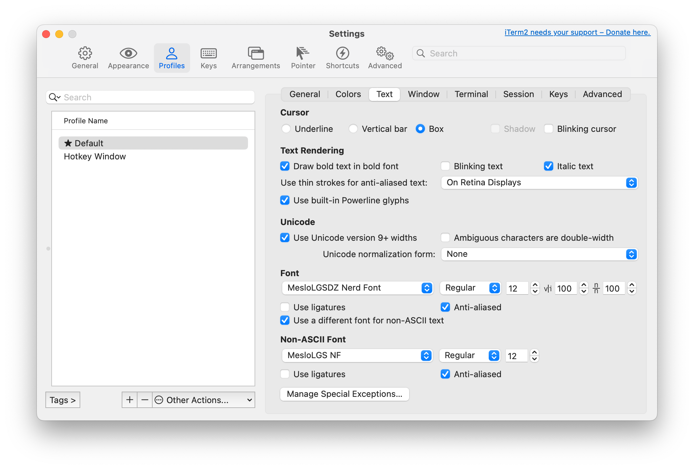

# powerline-rs

_Forked from [cirho/powerline-rust](https://github.com/cirho/powerline-rust) and adjusted for personal taste_


powerline-rs is a pure-rust version of [powerline-SHELL](https://github.com/b-ryan/powerline-shell). It's heavily
inspired
by it, but focuses on minimalizing time of execution and supporting a limited subset of features.

## Advantages

- blazing fast (~15ms when reading from a config file, 9ms for a compiled binary)
- runs backends only when needed (huge time improvements when not in a git repo or python venv)
- optional caching git results in memory or file
- supports fully compiled prompts (see `examples/rainbow.rs`) or can read from a provided config file.
- new themes and modules can be added easily (currently only Rainbow and Simple are included)
- supports multiline prompts as well as showing info on the right hand side of the terminal.

## Installation

powerline-rs relies on [Nerd Font](https://www.nerdfonts.com/) unicode characters - configure your terminal to use a
Nerd Font, otherwise most segments will not render correctly. Meslo LG S is recommended and can be
downloaded in patched form [here](https://github.com/ryanoasis/nerd-fonts/releases/download/v3.2.1/Meslo.zip).

iTerm2 users are recommended to enable the "Use builtin Powerline glyphs" option even when using a Nerd Font as this
seems to fix some character alignment issues.



Clone the repo and install for your desired SHELL:

```bash
cargo install --git https://github.com/alxhill/powerline-rs.git
```

You can also install (or create your own) compiled command by adding `--example {name}` to cargo command and
modifying your SHELL config to call the custom binary.

Make sure cargo's bin directory is in your `$PATH`.

### bash

```bash
source <(powerline init bash)
```

### zsh

```zsh
source <(powerline init zsh)
```

### fish

```bash
powerline init fish | source
```

## Customization

Powerline will create a default config file at `$HOME/.config/powerline-rs/config.json`. You can edit it to make
changes, which will be reflected immediately.

### Config file

`config.rs` has the full definition of all valid types in the config directory, `example_config.json` shows a complete
configuration setup.

The only two themes at the moment are "rainbow" and "simple". New themes must be added in code at the moment, and the
simple theme is not recommended.

The example_config.json shows most of the options available:

```json
{
  "theme": "rainbow",
  "rows": [
    {
      "left": [
        "small_spacer",
        {
          "cwd": {
            "max_length": 60,
            "wanted_seg_num": 4,
            "resolve_symlinks": false
          }
        },
        "read_only",
        "small_spacer",
        "git"
      ],
      "right": [
        {
          "separator": "round"
        },
        "python_env",
        {
          "padding": 0
        }
      ]
    },
    {
      "left": [
        {
          "last_cmd_duration": {
            "min_run_time": "0ms"
          }
        },
        "cmd"
      ]
    }
  ]
}
```

You can add as many rows as desired. Each row has `left` and `right` properties for adding new segments - `left` is
required, while `right` is optional. The final row should have only a `left` property so the cursor can show next to
it - it's not currently possible to have a value showing on the right side next to a one-line prompt.

Inside the `left` and `right` arrays, you can add the following sections to for showing content:

* **cmd** - show `>` before user input. Turns red and shows the error code if the previous command fails.
* **cwd** - show the current working directory, with configurable size and max segments.
* **cmd_duration** - show the time taken by the last command if it takes longer than `min_run_time`
* **host** - the hostname
* **user** - the current user
* **read_only** - show a lockfile icon if the current directory is read only
* **time** - show the current time, with an optional "format" - this has to be present, but can be null
* **python_env** - if a virtual env (venv, conda, mamba) is active, show the name and current version of python
* **cargo** - show a crab icon if a `Cargo.toml` file is present in the current dir
* **git** - show the current git branch and status of the repo (modified, staged, and untracked files, plus git remote
  ahead/behind stats)

There are also three ways to modify the layout:

* **separator** - change the style between segments (see screenshot above). Options are "chevron" and "round". This
  command is stateful, and will apply to all subsequent segments on the same section until overridden. The default is "
  chevron"
* **small_spacer** and **large_spacer** - show a segment as part of the current block with a black background
* **padding** - end the current collection of segments and clear the background. The next segment will start with a
  reversed separator separating it from the previous command.

Usage examples of most of these can be found in the config file shown above.

## Custom program

You can also create a separate rust program to fully customize the appearance. This allows creating a new theme too.

```rust
use powerline::{modules::*, theme::SimpleTheme};

fn main() {
    let mut prompt = powerline::Powerline::new();

    prompt.add_module(User::<SimpleTheme>::new());
    prompt.add_module(Host::<SimpleTheme>::new());
    prompt.add_module(Cwd::<SimpleTheme>::new(45, 4, false));
    prompt.add_module(Git::<SimpleTheme>::new());
    prompt.add_module(ReadOnly::<SimpleTheme>::new());
    prompt.add_module(Cmd::<SimpleTheme>::new());

    println!("{}", prompt);
}


```

### Cache untracked files

Git module can be slower on repos with big number of untracked files. Read about caching untracked
files  [here](https://git-scm.com/docs/git-update-index).

### Custom theme

```rust
use powerline::{modules::*, terminal::Color};

struct Theme;

impl CmdScheme for Theme {
    const CMD_FAILED_BG: Color = Color(161);
    const CMD_FAILED_FG: Color = Color(15);
    const CMD_PASSED_BG: Color = Color(236);
    const CMD_PASSED_FG: Color = Color(15);
}

fn main() {
    let mut prompt = powerline::Powerline::new();
    prompt.add_module(Cmd::<SimpleTheme>::new());

    ...
```

TODO:

- Change git icon/name based on branch vs commit vs merging
- Add java / gradle / jenv / sdkman support
- Better multiline prompts (e.g lines between)
- Improve spacing / centering support
- Calculate column width more accurately
- Improve display when there aren't enough columns to show the whole prompt
