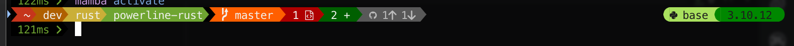

# powerline-rs
_Forked from [cirho/powerline-rust](https://github.com/cirho/powerline-rust) and adjusted for personal taste_



powerline-rs is a pure-rust version of [powerline-shell](https://github.com/b-ryan/powerline-shell). It's heavily inspired
by it, but focuses on minimalizing time of execution and supporting a limited subset of features.

## Advantages

- blazing fast (~15ms when reading from a config file, 9ms for a compiled binary)
- runs backends only when needed (huge time improvements when not in a git repo or python venv)
- optional caching git results in memory or file
- supports fully compiled prompts (see `examples/rainbow.rs`) or can read from a provided config file.
- new themes and modules can be added easily (currently only Rainbow and Simple are included)
- supports multiline prompts as well as showing info on the right hand side of the terminal.

## Simple installation

powerline-rs relies on using a [Nerd Font](https://www.nerdfonts.com/) - configure your shell to use a Nerd Font,
otherwise many characters will not render correctly. Meslo LG S is recommended and can be found [here](https://github.com/ryanoasis/nerd-fonts/releases/download/v3.2.1/Meslo.zip).

iTerm2 users are recommended to enable the "Use builtin Powerline glyphs" option even when using a nerdfont as this
seems to fix any potential character alignment issues.


```bash
git clone https://github.com/cirho/powerline-rust
cd powerline-rust
# bash shell 
cargo install --path .
# zsh shell 
cargo install --path . --no-default-features --features=zsh-shell,libgit
# fish shell
cargo install --path . --no-default-features --features=bare-shell,libgit
```

You can also install one of examples by adding `--example {name}` to cargo command.

### Create a config.json

The config for the shell in the screenshot is:

```json
{
  "theme": "rainbow",
  "rows": [
    {
      "left": [
        "small_spacer",
        "read_only",
        {
          "cwd": {
            "max_length": 60,
            "wanted_seg_num": 5,
            "resolve_symlinks": false
          }
        },
        "small_spacer",
        "git"
      ],
      "right": [
        {
          "separator": "round"
        },
        "python_env",
        {
          "padding": 0
        }
      ]
    },
    {
      "left": [
        {
          "last_cmd_duration": {
            "min_run_time": "5ms"
          }
        },
        "cmd"
      ]
    }
  ]
}
```

## Setting up shell

First, create a config.json file (see "config file" section below). Then, ensuring the `powerline` binary is in `$PATH`,
setup the prompt for your chosen shell.

### bash

```bash
function _update_ps1() {
    PS1="$(powerline -s $? -c $COLUMNS $HOME/.config/powerline.json)"
}

if [ "$TERM" != "linux" ]; then
    PROMPT_COMMAND="_update_ps1; $PROMPT_COMMAND"
fi
```

todo: add last command duration + fix last command status

### zsh

You must also compile with `zsh-shell` feature.

```zsh
_update_ps1() {
    PS1="$(powerline -s $? -c $COLUMNS $HOME/.config/powerline.json)" 
}
precmd_functions+=(_update_ps1)
```

### fish

You must also compile with `bare-shell` feature.

```bash
# $CMD_DURATION isn't exported, cache it here for the fish_prompt command + reset it each time
function cachetime --on-event fish_postexec
  set -gx duration $CMD_DURATION
end

function fish_prompt
  powerline -s $status -c $COLUMNS "$HOME/.config/powerline.json" $duration
  set -gx duration 0
end

# disable any default right prompt (e.g python env)
function fish_right_prompt
end
```

## Custom shell prompt

There are two ways to customize the prompt - writing a config.json file using the default `powerline` command, or
writing a custom program.
Custom programs allow creating new themes and modules, but require recompilation to make even minor changes.

### Config file

`config.rs` has the full definition of all valid types in the config directory, `example_config.json` shows a complete
configuration setup.

### Custom program

Simply create new rust program that fulfils your requirements.

```rust
use powerline::{modules::*, theme::SimpleTheme};

fn main() {
    let mut prompt = powerline::Powerline::new();

    prompt.add_module(User::<SimpleTheme>::new());
    prompt.add_module(Host::<SimpleTheme>::new());
    prompt.add_module(Cwd::<SimpleTheme>::new(45, 4, false));
    prompt.add_module(Git::<SimpleTheme>::new());
    prompt.add_module(ReadOnly::<SimpleTheme>::new());
    prompt.add_module(Cmd::<SimpleTheme>::new());

    println!("{}", prompt);
}


```

## Tips and trigs

### Strip executable

Remove unnecessary symbols from file to greatly reduce size of it.
Theoretically it can reduce time of execution.

```bash
cd ~/.cargo/bin/
strip powerline
```

### Use LTO and other

```toml
# Cargo.toml
[profile.release]
lto = true
panic = 'abort'
```

### Target native

Enables optimizations for your specific processor.

```bash
RUSTFLAGS="-C target-cpu=native" cargo ...
```

### Cache untracked files

Git module can be slower on repos with big number of untracked files. Read about caching untracked
files  [here](https://git-scm.com/docs/git-update-index).

### Custom theme

```rust
use powerline::{modules::*, terminal::Color};

struct Theme;

impl CmdScheme for Theme {
    const CMD_FAILED_BG: Color = Color(161);
    const CMD_FAILED_FG: Color = Color(15);
    const CMD_PASSED_BG: Color = Color(236);
    const CMD_PASSED_FG: Color = Color(15);
}

fn main() {
    let mut prompt = powerline::Powerline::new();
    prompt.add_module(Cmd::<SimpleTheme>::new());

    ...
```

TODO:

- Change git icon/name based on branch vs commit vs merging
- Add java / gradle / jenv / sdkman support
- Add cargo / rust support (not sure what this should actually show tho)
- Better multiline prompts (e.g lines between)
- Improve spacing / centering support
- Calculate column width more accurately
